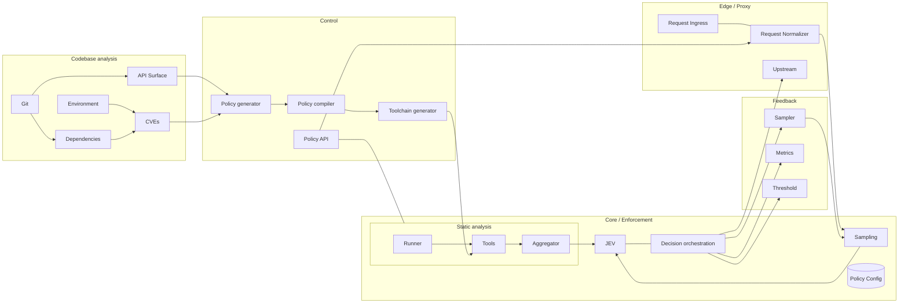

# CLAUDE.md — Tessera interactive demo ("Trace a request")

Build an interactive demo page inside the existing landing app (Vite + React 19 + TypeScript strict + Tailwind v4 + `motion/react` + `lucide-react`). Reuse the existing design tokens, `src/components/ui/*`, `src/lib/*` and `src/styles/globals.css`. Do not add dependencies; the diagram is hand-drawn SVG + motion. Add the route/section so it is reachable from the Header ("Demo") and the Hero CTA. Do not touch the existing landing sections beyond that link.

## Goal

A visitor **traces one real-looking attack request through the whole Tessera architecture, step by step**, and learns how Tessera works by doing so. The scenario is **CVE-2025-43960 in Adminer**. They should leave understanding: (1) Tessera learns the app first, (2) generates a per-endpoint/per-field policy, (3) every request passes cheap static analysis, (4) only suspicious/sampled requests reach the AI (JEV), (5) the system adapts via EWMA feedback.

## What Tessera is (source of truth for copy — do not contradict)

Tessera is an adaptive security layer in front of an existing web app; no rewrite, no SDK. It first builds an understanding of the app from codebase, dependencies, configuration and runtime environment, then generates an application-specific policy describing what normal requests look like and which checks matter per endpoint and field. At runtime it is a transparent reverse proxy: every HTTP request passes a configurable static-analysis toolchain (schema violations, injection, malicious input, resource abuse, suspicious URLs, semantic anomalies, malicious files via magic-byte validation). Only suspicious or sampled requests reach **JEV**, the AI decision layer, which evaluates the request + static evidence + recent request context and returns a **maliciousness score and confidence**. Tessera combines that with configurable thresholds to **allow or block**. It adapts: instead of analysing a fixed % forever, it tracks attacks with **EWMA-based feedback**, raising analysis on endpoints that get more dangerous and lowering it elsewhere (security vs latency vs AI cost). Policies are generated automatically, reviewed/edited by admins, or imported; they work at endpoint and individual-field level.
Core value: application-specific protection, adaptive AI analysis, low runtime overhead, one deployable proxy.

## The scenario: CVE-2025-43960 (Adminer ≤ 4.8.1)

PHP Object Injection / DoS. Triggered when Adminer uses the Monolog library for logging. The attacker sends a forged serialized payload; deserialization leads to RAM exhaustion and hangs the server. **No official patch**; recommended mitigation is limiting Monolog usage or filtering classes. This is the perfect Tessera story: a patch never arrives, but a policy can block it today.

Use a concrete, plausible (non-weaponised, clearly fake/truncated) request, e.g.:
```
POST /adminer/?server=db&username=root HTTP/1.1
Host: app.example.com
Content-Type: application/x-www-form-urlencoded

auth[driver]=server&state=O:37:"Monolog\Handler\BufferHandler":4:{s:10:"bufferSize";i:99999999;…<truncated>}
```
Never ship a working exploit; keep the payload a shortened illustrative string and label it "illustrative".

## Architecture to visualise (Mermaid reference — render as animated SVG, not as a Mermaid embed)


Edges that are ambiguous in the original diagram: treat `Sampling` as the gate that decides whether JEV is called, `Policy Config` as the store consumed by Decision/Sampling/Runner, and `Feedback` as the loop that updates sampling rates.

## Demo flow — 3 phases, ~14 steps

A left/centre **diagram canvas** (nodes highlight, a packet dot travels along edges with `motion`), a right **inspector panel** per step, and a bottom **stepper** (Prev / Next / Auto-play / Reset, step dots, keyboard ←/→/space). The URL hash stores the step (`#step=7`) so steps are linkable.

**Phase 1 — Learn the app (offline, before any traffic)**
1. **Git** — Tessera reads the repo. Panel: shows the Adminer app tree.
2. **Dependencies** — finds `vrana/adminer 4.8.1` + `monolog/monolog`.
3. **Environment** — PHP version, Monolog enabled, exposed `/adminer/` route.
4. **CVEs** — match: CVE-2025-43960, ≤ 4.8.1, no patch. Show the CVE card (type, affected, "no official patch").
5. **API Surface** — endpoints & fields extracted (`POST /adminer/` → `auth[driver]`, `state`, …).
6. **Policy generator → Policy compiler → Toolchain generator** — one step, three sub-beats. Show the generated policy (YAML/JSON, per endpoint and per field): `state` must not match a serialized-object pattern, class allow-list excludes `Monolog\Handler\*`, max body size, `risk: high`. Show the toolchain it compiled to. Mention admins can edit/import the policy via **Policy API** (include a small editable policy view — toggling a rule changes the later outcome).

**Phase 2 — Trace the request (runtime)**
7. **Request Ingress** — the attack request arrives; show raw request.
8. **Request Normalizer** — decoded/canonicalised; policy for `POST /adminer/` attached from Policy API/Config.
9. **Static analysis: Runner** — selects the checks relevant to this endpoint/field.
10. **Tools** — parallel checks as a list with pass/fail chips: schema ✓, injection ✓, malicious input **✗ serialized object in `state`**, resource abuse **⚠ declared size 99,999,999**, suspicious URL ✓, semantic anomaly ⚠, magic bytes n/a.
11. **Aggregator** — merges evidence into one suspicion signal.
12. **Sampling** — decides JEV is needed (suspicious → always). Contrast mini-panel: a benign request `GET /adminer/?username=root` is **not** sent to JEV (cheap path, no AI cost). Include a "Switch to benign request" toggle that replays steps 7–14 down the fast path.
13. **JEV** — receives request + static evidence + recent request context; returns e.g. `maliciousness 0.97, confidence 0.91`, with a short human-readable rationale ("untrusted data deserialised into a logging handler; known CVE-2025-43960 pattern").
14. **Decision orchestration** — score/confidence vs **Threshold** (slider the user can move, e.g. block ≥ 0.80; show the verdict flipping). Outcome **BLOCK** (HTTP 403, never reaches **Upstream**); benign → ALLOW and forwarded to Upstream.

**Phase 3 — Adapt (feedback)**
15. **Sampler / Metrics / Threshold** — the block updates the EWMA attack rate for `POST /adminer/`; show a small sparkline: sampling rate for that endpoint rises, other endpoints stay low. Final recap card with the 5 takeaways, then CTA to the deploy dialog (reuse `DeployDialog`).

Each step has: `id`, `phase`, `title`, `highlightNodes[]`, `highlightEdges[]`, `packet` (from→to), `explain` (1–3 sentences, plain English), `why it matters` (one line), `data` (the artefact shown in the panel: request, policy, tool results, JEV output…). Put all of this in `src/data/demo.ts` as typed data; the UI is a dumb renderer of that array. Add types to `src/types/index.ts`.

## UX requirements

- Plain-English first; jargon (EWMA, magic bytes, JEV) gets an inline tooltip/"learn more" expander, not a wall of text.
- Interactivity beyond Next: editable policy rule (step 6), benign/attack toggle (step 12), threshold slider (step 14). The outcome must truly depend on these.
- Diagram is clickable: clicking a node jumps to its step. Dim nodes not in the current phase.
- Polish copy ("Tessera", "JEV") is English only; keep voice consistent with the landing (`src/data/content.ts`).
- Responsive: on mobile the diagram collapses to a vertical list of the current step's nodes above the panel. Respect `prefers-reduced-motion` (no travelling packet, instant highlight).
- Accessible: stepper is keyboard operable, panel is an `aria-live="polite"` region, status chips never rely on colour alone.
- Everything runs client-side with mocked data — no backend, no network calls. State via `useState`/`useReducer`; no state library.

## Constraints

- No new dependencies, no Mermaid runtime, no charting lib (sparkline = tiny inline SVG; check `components/ui` first).
- `npm run build` (tsc strict) must pass. No `any`.
- Match existing file/naming/style conventions; one component per file in `src/components/demo/` (`DemoPage`, `ArchitectureCanvas`, `StepPanel`, `Stepper`, plus per-step panels only where the data view is non-trivial).
- Keep the CVE payload illustrative and truncated.
